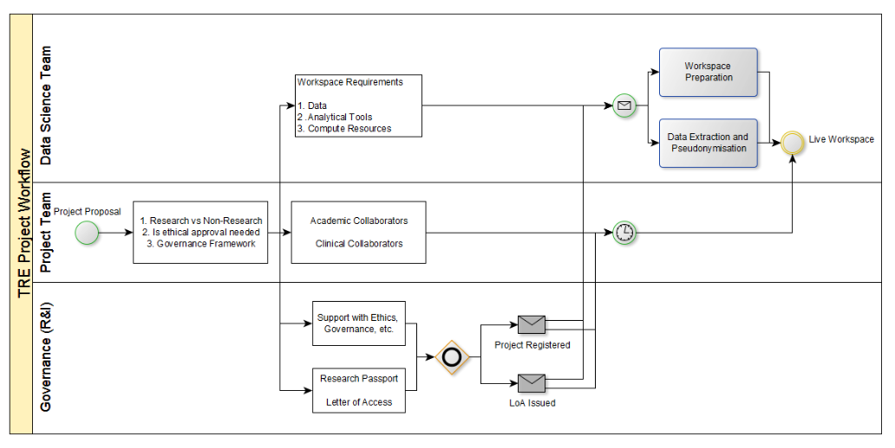

# Information Governance And Ethics

```{note}
Describe the process researchers will go through to obtain permissions to access and analyse data in a workspace in your SDE for R&D. This should cover:

- User accreditation and permissions
- Data Access Committee(s)
- Ethics  
```

GM have already solved this to a large extent.

Precedents to build upon:

- <https://digital.nhs.uk/services/data-access-request-service-dars>
- <https://saildatabank.com/data/apply-to-work-with-the-data/>

Flowcharts:


