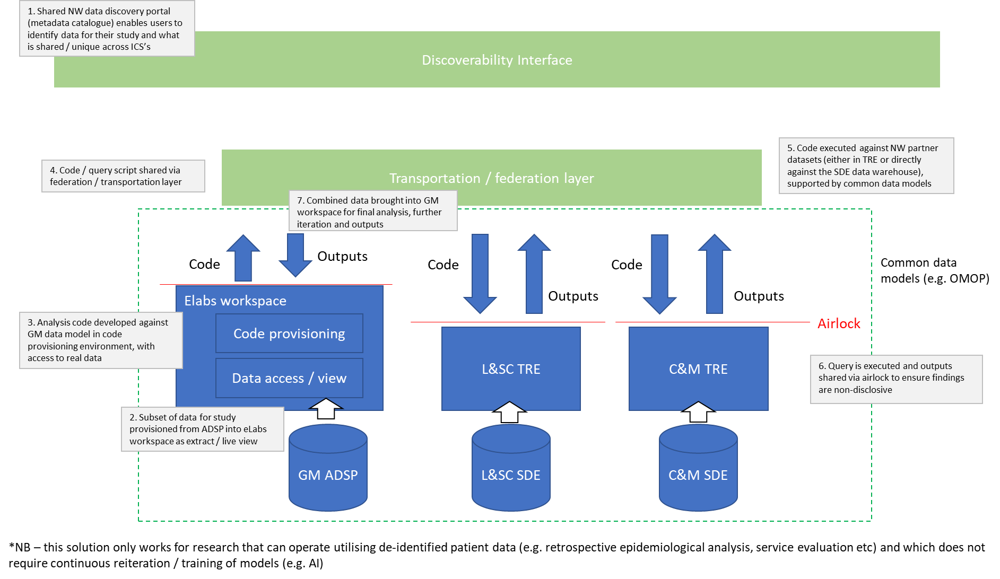

# SCRAPBOOK

## TRE vs SDE vs IDL

### Bradley/Vishnu

1. Interoperability
2. Multiple capabilities that evolve in parallel over time
3. Avoid monolithic architectures – for data and analytics
4. Embrace pragmatic monolithic architectures for data discoverability, researcher experience, pseudonymisation/anonymisation processes, DARS, etc.

I think you have captured our conversation well. I think the ‘three’ TREs will sit above the transportation/federation layer with the airlock line immediately between the TREs above and the transportation layer below.

I am using the term data lakes and not SDE as NHSE have appropriated the SDE term for the wrong purpose here.

Let’s call our SDEs  IDLs (ICB data lakes) to add to the confusion!

__Agreed:__ Data is held in three IDLs (GM, LSC and CM) – each will progress at different pace depending on local needs. Each will also support multiple other use cases both at ICB level (eg. population health) or regional level (eg. commissioning, research, etc.). This supports the “build once, use many” approach which is vital for efficiencies.

__Agreed:__ The data transportation and data discoverability functions will operate across all three data lakes as well as any number of other data sources (eg. CSU, social care, SAIL, NWAS, etc.) that are not part of the ICB data lakes (yet).

Research teams use the data discoverability function to identify what data they require for a particular project and where it is available. They then request this data through the DARS.

__Subtly different:__ The data transportation function (people and processes) will be responsible for pulling this data from the IDLs, curate it, pseudonymise/anonymise as appropriate and after all kinds of 5-safes compliance checks, push this data through the airlock into a TRE workspace – this could be a ELabs workspace, AzureTRE workspace or whatever as long as it meets the criteria. Or expose this data through documented, version-controlled APIs and the research team can pull it on demand – will be more useful where the data is getting refreshed regularly or is a live stream.

__Remote Execution:__ Not all use cases can be solved with remote execution. The EOI spec speaks of a separate code development area and data areas. This doesn’t make sense for many use cases where iterative analysis is part of the process. OpenSAFELY is not the panacea to all privacy concerns. A combination of approaches that pragmatically balances tech and processes to enforce 5-safes will be important – OpenSAFELY +/- OHDSI/OMOP +/- Anonymisation +/- safe people/safe projects.

__Two questions remain:__

- What happens to anonymised curated datasets prepared for one project after that project is over?
- Do we create curated datasets pre-emptively in the absence of a direct need?

In terms of research use cases, what we are discussing already supports observational research. For trials, we can easily spin up something like RedCap within one of these ‘airlocked’ workspaces. Or anything else for that matter.

...

From: Bradley Quinn  
Sent: 21 September 2022 16:01
To: Chandrabalan Vishnu (LTHTR)  
Subject: NW conceptual architecture

Hi Vishnu,

Good to chat just now – a really useful discussion.
On the back of our talk I’ve pulled together the diagram below. It is very crude, and doesn’t work in every instance (e.g. clinical trials with consent that require identifiable data, AI development with model training etc) but conceptually, this is my attempt to summarise what I think we are moving towards for a NW solution for federation. Certainly in the near-term, this would be a way for us to demonstrate that the NW approach works for areas where we already have alignment in data structure (e.g. SUS). I’ve focused on what it’s application would look like to GM but it would equally apply for L&SC / C&M.

Is this an accurate summary?

The bits in green are “shared” infrastructure (e.g. a single metadata catalogue, a NW federation layer that can lift & shift queries across) – in blue is ICS / local level

BW
Bradley
